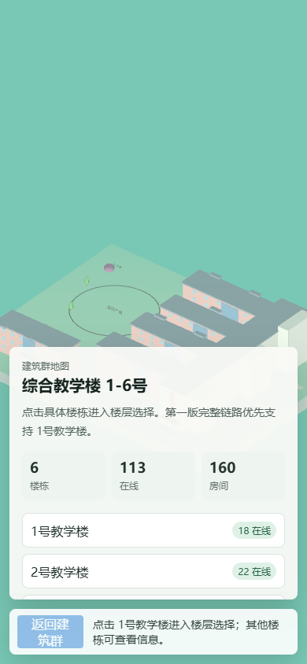

# CampusLiving

CampusLiving 是一个面向校园空间的 3D 可视化与社交原型项目。当前版本以河南大学金明校区“综合教学楼 1-6 号”建筑群为样板，使用 Low-Poly 校园地图风格呈现建筑、楼层与房间入口，为后续的自习室占座、楼层导航、空间社交和实时状态展示打基础。



## 项目定位

项目希望把传统二维校园地图升级为可交互的三维校园空间入口。用户进入页面后，可以先看到综合教学楼建筑群，再点击具体楼栋进入楼层选择，最后进入房间列表。第一阶段优先打通“建筑群 -> 1 号教学楼 -> 楼层 -> 房间”的完整链路。

整体视觉延续校园导览图的等距、低多边形、轻量卡通风格，既能保留地图识别度，也方便后续扩展到更多楼栋和功能模块。

## 当前功能

- 综合教学楼 1-6 号建筑群 3D 地图展示
- 1 号教学楼楼层拆分模型展示
- 点击楼栋进入楼层选择
- 点击楼层查看房间列表
- 本地模拟在线人数、房间数量与空座信息
- 固定视角展示，避免用户误操作导致模型丢失视野
- 桌面端与移动端响应式布局
- Blender 脚本生成 Low-Poly GLB 模型资产

## 技术栈

- Vite：前端开发与构建
- Three.js：3D 场景、模型加载、相机与拾取交互
- Vitest：数据、状态和相机逻辑测试
- Blender / Blender Python：Low-Poly 校园建筑建模与 GLB 导出
- GitHub：代码托管与版本管理

## 开发目标

### 第一阶段：综合教学楼样板

完成综合教学楼 1-6 号建筑群的交互样板，重点验证 3D 建筑选择、楼层选择、房间列表和移动端展示是否可行。

### 第二阶段：房间级空间社交

在房间页面中加入座位、在线用户、状态标签和聊天入口，形成“进入某个真实空间”的社交体验。房间数据先使用本地模拟，后续再替换为后端接口。

### 第三阶段：扩展校园建筑资产

将图书馆、食堂、体育馆、宿舍区、行政楼、实验楼、活动中心、咖啡厅等模型接入统一地图，形成完整的校园空间地图。

### 第四阶段：实时化与产品化

引入后端服务、用户登录、实时在线状态、房间热度、收藏地点和路线引导，让项目从原型过渡为可持续迭代的校园空间应用。

## 本地运行

```bash
npm install
npm run dev
```

默认访问地址：

```text
http://127.0.0.1:5173/
```

## 验证

```bash
npm test
npm run build
```

当前测试覆盖：

- 综合教学楼数据结构
- 页面状态流转
- 固定视角控制
- 地图相机取景逻辑

## 目录说明

```text
assets/                Blender 源文件、GLB 模型和预览图
docs/                  项目计划、规格说明和文档图片
public/assets/glb/     前端运行时加载的 GLB 模型
scripts/blender/       Blender 建模与渲染脚本
src/data/              建筑、楼层、房间模拟数据
src/three/             Three.js 场景、相机、模型加载和拾取逻辑
src/ui/                页面面板和状态管理
```

## 当前状态

项目已完成第一版 MVP：综合教学楼建筑群可视化、1 号教学楼楼层展示和房间列表链路已经跑通。下一步建议优先完善房间详情页，并逐步接入真实校园空间数据。
