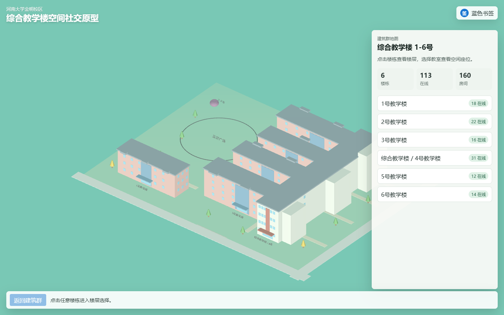
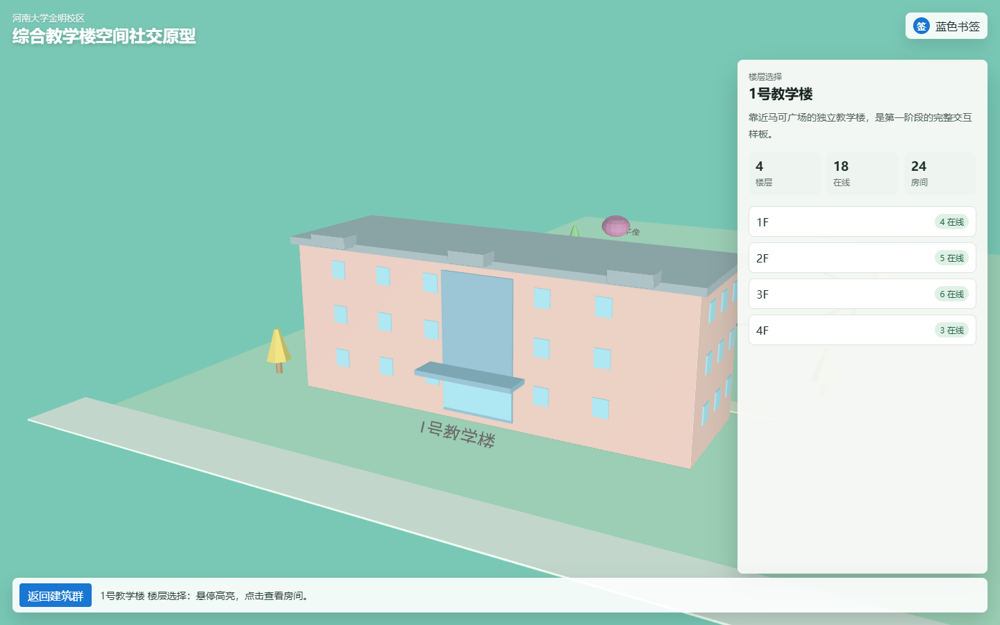
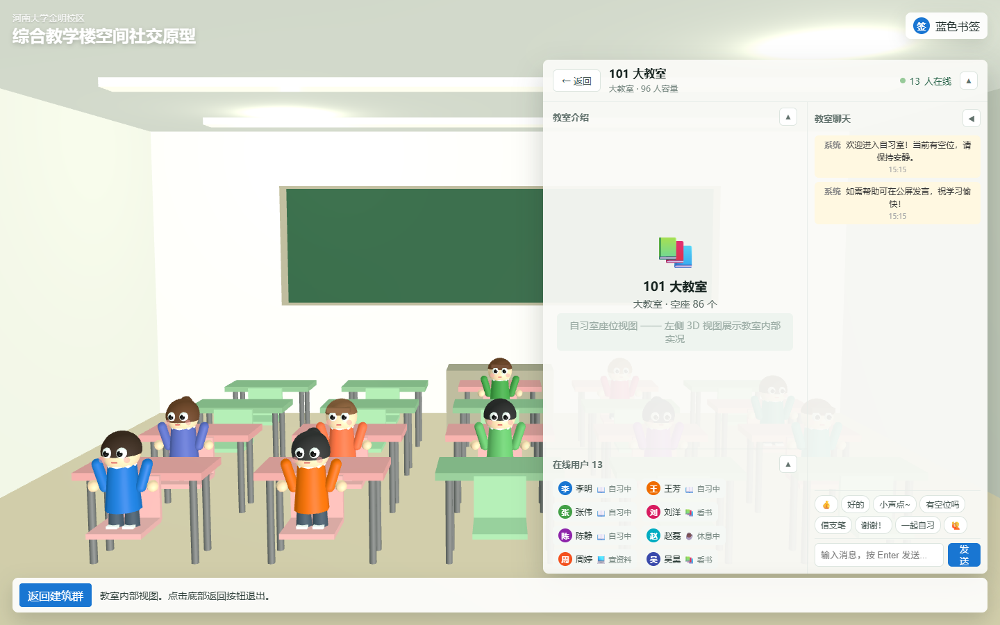

# CampusLiving — 校园空间社交原型

CampusLiving 是一个面向校园空间的 3D 可视化与社交原型项目。以河南大学金明校区"综合教学楼 1-6 号"建筑群为样板，使用 Low-Poly 卡通校园风格呈现建筑、楼层与教室，支持**自习室空闲查询、教室内部 3D 视图、多人在线聊天**等社交功能。

## 功能展示

### 建筑群地图



展示综合教学楼 1-6 号建筑群全景，点击任意楼栋可进入楼层选择。

### 楼层选择



点击楼栋后摄像机平滑飞入建筑前方，展示各楼层在线人数，点击楼层进入房间列表。

### 教室内部 3D 视图


点击房间后，摄像机沿贝塞尔曲线飞入教室内部，展示 Low-Poly 教室场景：桌椅、黑板、窗户，有人的座位自动生成 Q 版 Chibi 卡通小人。

### 自习室聊天



右侧面板包含教室介绍、在线用户列表和聊天窗口，三块面板均可独立折叠。支持公屏聊天、快捷回复，模拟多人在线自习场景。

---

## 当前功能

- 综合教学楼 1-6 号建筑群 3D 地图展示
- 所有教学楼楼层选择与房间列表通用化支持
- 点击楼栋 → 摄像机平滑弧线推进（Bezier 曲线 + Smoothstep 缓动）
- 点击房间 → 摄像机飞入教室内部 3D 视图
- 教室内部：Low-Poly 桌椅 + 占用座位显示 Q 版 Chibi 小人
- 自习室聊天：公屏消息、快捷回复、多用户模拟
- 教室介绍 / 在线用户 / 聊天 三面板独立折叠
- 本地模拟在线人数、房间数量与空座信息
- 桌面端与移动端响应式布局

## 技术栈

- **Vite**：前端开发与构建
- **Three.js**：3D 场景、GLB 模型加载、相机动画与拾取交互
- **Blender / Blender Python**：Low-Poly 校园建筑建模与 GLB 导出
- **GitHub**：代码托管与版本管理

## 项目结构

```text
assets/blender/            Blender 源文件
docs/                      项目文档、截图和规格说明
public/assets/glb/         前端运行时加载的 GLB 模型
scripts/blender/           Blender 建模与渲染脚本
src/
  classroom/              教室界面（聊天、用户模拟、样式）
  data/                   建筑、楼层、房间模拟数据
  three/                  Three.js 场景、相机、加载器、拾取、教室内部
  ui/                     页面面板和状态管理
  main.js                 应用入口
  styles.css              全局样式
```

## 本地运行

```bash
npm install
npm run dev
```

访问 `http://127.0.0.1:5173/`（端口可能自动递增）。

## 验证

```bash
npm test
npm run build
```

## 添加截图

将实际运行截图放入 `docs/images/` 目录，对应以下文件名：

| 截图 | 文件路径 |
|------|----------|
| 建筑群地图全景 | `docs/images/campus-map.png` |
| 楼层选择界面 | `docs/images/campus-floors.png` |
| 教室内部 3D 视图 | `docs/images/campus-classroom-3d.png` |
| 自习室聊天界面 | `docs/images/campus-classroom-chat.png` |

截图后刷新 README 即可看到效果。