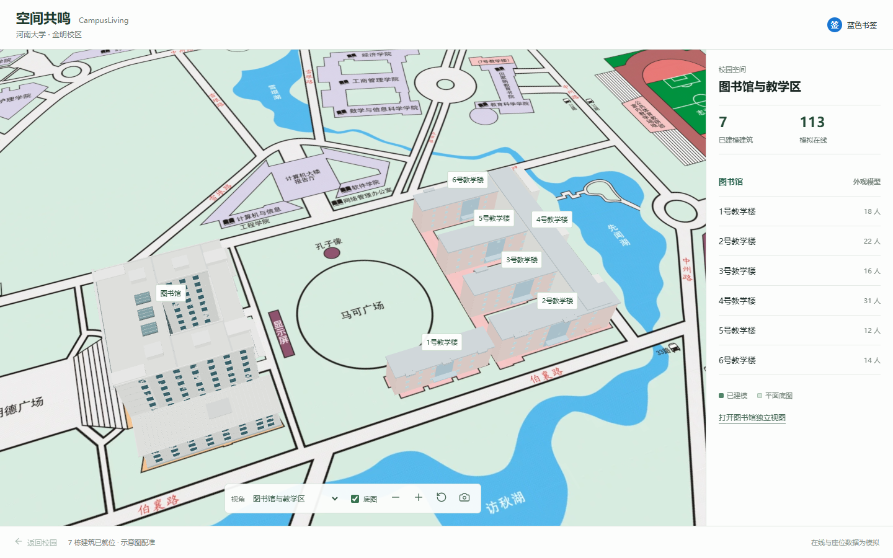
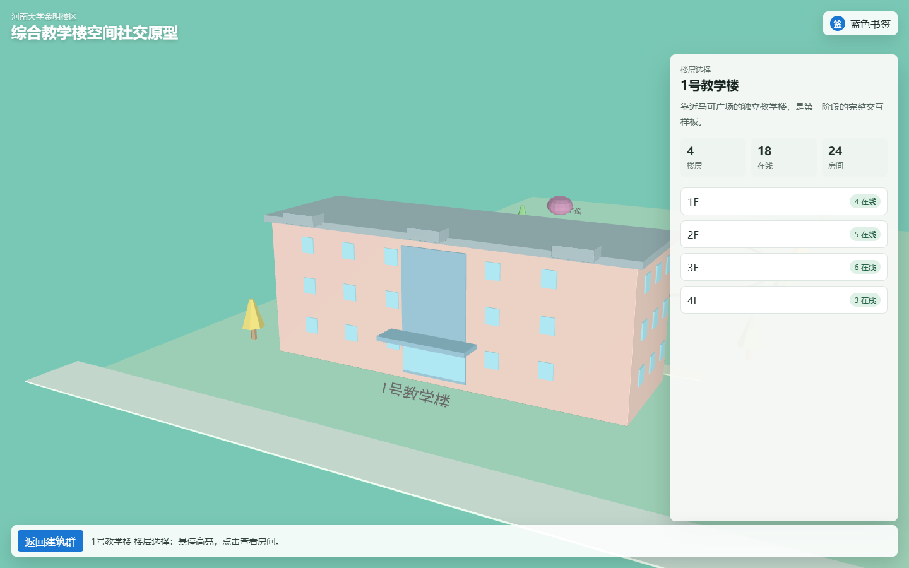
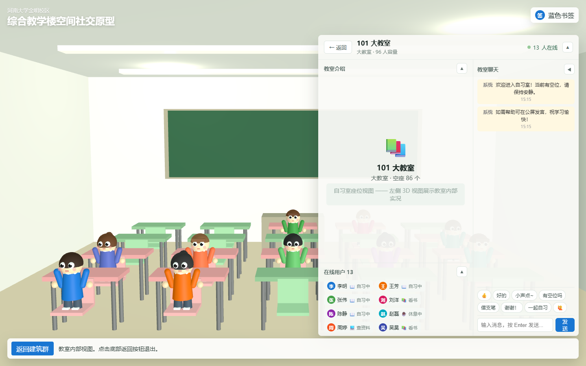
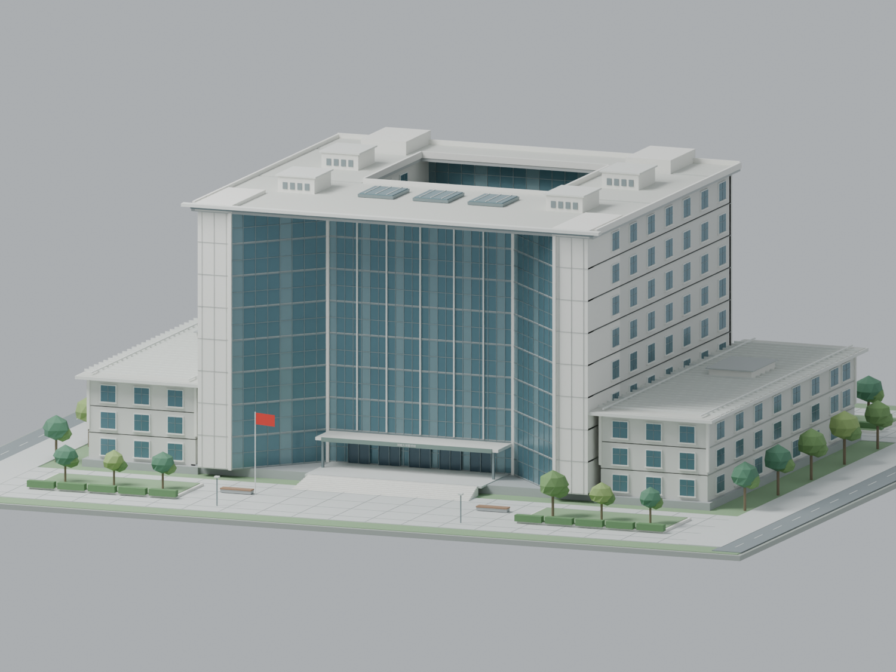

# CampusLiving — 校园空间社交原型

CampusLiving（空间共鸣）是一个以真实校园空间为入口的匿名社交原型。首页将河南大学金明校区图书馆和 1–6 号教学楼放在同一张校园布局图上，教学楼保留楼层、房间、教室内部 3D 视图及聊天演示。在线人数、座位与聊天均为本地模拟，尚未接入真实多人服务。

## 功能展示

### 建筑群地图



图书馆与 1–6 号教学楼同时显示，可切换核心区斜视、核心区俯视和全校平面视角。点击模型、建筑标签或侧栏可选择建筑；其他区域仅保留平面底图，不额外建模。

### 楼层选择



选择教学楼后摄像机聚焦建筑，通过侧栏选择演示楼层，再进入房间列表。现有教学楼模型没有独立楼层网格，楼层选择不代表真实楼层剖切。

### 教室内部 3D 视图


点击房间后进入 Low-Poly 演示教室：桌椅、黑板、窗户，以及模拟有人座位上的 Q 版 Chibi 人物。此视图不是依据真实教室平面图建模。

### 自习室聊天



右侧面板包含教室介绍、在线用户列表和聊天窗口，三块面板均可独立折叠。支持公屏聊天、快捷回复，模拟多人在线自习场景。

---

## 当前功能

- 独立图书馆外观模型：多视角查看、自动旋转、屋顶与场地显隐、截图和 GLB 下载
- 图书馆与 1-6 号教学楼在统一校园场景中按布局图定位
- 核心区斜视 / 俯视 / 全校平面、底图显隐、缩放、旋转、复位和截图
- 所有教学楼楼层选择与房间列表通用化支持
- 点击楼栋 → 摄像机平滑聚焦（Smoothstep 缓动）
- 点击房间 → 摄像机飞入教室内部 3D 视图
- 教室内部：Low-Poly 桌椅 + 占用座位显示 Q 版 Chibi 小人
- 自习室聊天：公屏消息、快捷回复、多用户模拟
- 教室介绍 / 在线用户 / 聊天 三面板独立折叠
- 本地模拟在线人数、房间数量与空座信息
- 桌面端与移动端响应式布局

## 技术栈

- **Vite**：前端开发与构建
- **Three.js**：3D 场景、GLB 模型加载、相机动画与拾取交互
- **Blender / Blender Python**：Low-Poly 校园建筑建模与 GLB 导出
- **GitHub**：代码托管与版本管理

## 项目结构

```text
assets/blender/            Blender 源文件
docs/                      项目文档、截图和规格说明
public/assets/glb/         前端运行时加载的 GLB 模型
public/assets/maps/        校园底图与来源、裁剪记录
scripts/prepare-campus-map.mjs  可选的底图预处理脚本
scripts/blender/           Blender 建模与渲染脚本
src/
  library/                图书馆独立查看器、相机和模型检查
  classroom/              教室界面（聊天、用户模拟、样式）
  data/                   建筑、楼层、房间模拟数据
  three/                  Three.js 场景、相机、加载器、拾取、教室内部
  ui/                     页面面板和状态管理
  main.js                 应用入口
  styles.css              全局样式
  campus.css              统一校园页面布局与移动端适配
```

## 本地运行

```bash
npm install
npm run dev
```

访问 `http://127.0.0.1:5173/`（端口可能自动递增）。

首页直接显示全部 7 栋建筑。选择“图书馆”后可打开独立视图，或访问相同端口的 `/library.html`。运行所需的底图、模型和预览均已放入 `public/`，不需要 Blender 或原始图片。

## 校园布局

底图来自用户提供的 `jmxq.jpg`（6398 × 8267 像素），裁去外围标题和边框后生成本地 WebP；来源和裁剪信息见 `public/assets/maps/jinming-campus.source.json`。布局图不是测绘图，模型位置、朝向和占地属于示意配准，不宣称真实地理坐标或实测尺寸。

- 图书馆位于马可广场西侧，正面入口朝向西大门。
- 1 号教学楼在广场南侧；2、3、5、6 号楼从南向北排列，4 号楼位于东侧。
- 模型配准参数集中在 `src/data/campusLayout.js`：`center` 是归一化图片坐标，`size` 是占地范围，`rotation` 是绕竖直轴的旋转角。
- `src/three/campusMap.js` 组装独立模型，排除原展示底座与标注；不修改 Blender 源文件及原始 GLB。建筑横向尺寸匹配布局图，高度随水平缩放的几何平均值调整。
- 图书馆仅开放外观查看，不虚构其楼层、房间或座位；其他建筑、道路和湖泊仅作平面背景。

可选：安装 `sharp` 后，从原图重新生成底图（会覆盖打包底图）：

```powershell
node scripts/prepare-campus-map.mjs 'F:\桌面\jmxq.jpg'
```

也可用环境变量 `CAMPUS_SHARP_MODULE` 指向已有 `sharp` 模块的文件 URL。公开交付前应确认底图的使用与发布授权。

## 图书馆模型

依据用户提供的河南大学图书馆多视角参考图重建。照片、屋顶俯视图与部分补充效果图存在差异，侧面和背面优先参考实景照片。参考图标注约 100 × 70 × 45 米，仅作为比例依据；外挑屋檐使导出包围尺寸略大。

本轮重点修正正面凹入玻璃幕墙：中央退进约 11.9 米，两侧斜面与正立面方向夹角约 46°，楼板、门厅、雨棚与幕墙统一遵循同一轮廓。这些数值是根据参考图调整的建模参数，不是实测尺寸。主楼八层同样为外观推定，尚未建模真实室内房间、座位和功能分区。



- 可编辑源文件：`assets/blender/library_jinming.blend`
- 导出模型与参数：`assets/glb/library_jinming.glb`、`assets/glb/library_jinming.metadata.json`
- 前端资源：`public/assets/glb/library_jinming.glb`，生成时自动同步
- 建模脚本：`scripts/blender/build_library_jinming.py`

使用 Blender 4.3.2 重新生成模型和预览（按本机安装位置调整可执行文件路径）：

```powershell
& 'D:\software\blender.exe' --background --python-exit-code 1 --python scripts/blender/build_library_jinming.py -- --render
```

省略 `-- --render` 可跳过预览渲染。生成操作覆盖上述图书馆输出，不修改教学楼的 `campus_assets.blend`。GLB 使用米制、Y 轴向上，网格包含 `buildingId`、`part` 和 `level` 属性，用于建筑、屋顶、场地分组。

## 验证

```bash
npm test
npm run build
```

浏览器检查需要已安装的 `playwright` 和 Chromium。先启动开发服务，再执行：

```powershell
$env:CAMPUS_BASE_URL='http://127.0.0.1:5174'
node scripts/check-campus.mjs
node src/library/viewer.browser-check.mjs
```

第二条检查使用前一步构建得到的 `dist/`，不依赖开发服务。可用 `LIBRARY_PLAYWRIGHT_MODULE` 指向已有 Playwright 模块的文件 URL，用 `LIBRARY_CHROMIUM_PATH` 指定浏览器可执行文件。校园检查覆盖桌面和手机视口、7 栋建筑、视角切换、直接拾取、教室返回与截图下载，截图输出至 `assets/previews/campus-checks/`。

## 添加截图

将实际运行截图放入 `docs/images/` 目录，对应以下文件名：

| 截图 | 文件路径 |
|------|----------|
| 建筑群地图全景 | `docs/images/campus-map.png` |
| 楼层选择界面 | `docs/images/campus-floors.png` |
| 教室内部 3D 视图 | `docs/images/campus-classroom-3d.png` |
| 自习室聊天界面 | `docs/images/campus-classroom-chat.png` |

截图后刷新 README 即可看到效果。
